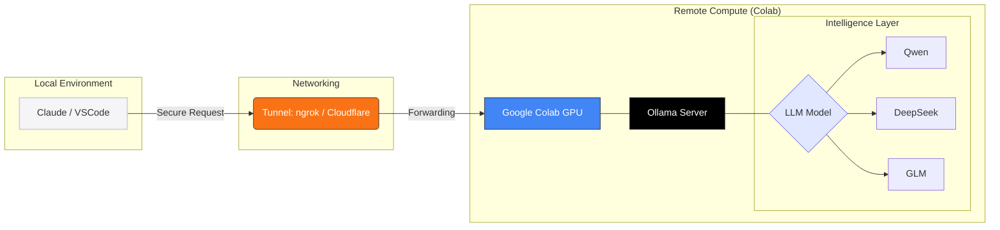

# Your Laptop Is Too Weak : Run Coding model on Collab

Tried Ollama models ?
Strugling with bigger models on your machine ? or Don't have enough good mahine to run basic models ? and Don't have GPU 

No problem here we have Google collab gives T4 GPU free and sometimes v5e-1 TPU also

Let's run the model on Collab with help of Ollama. But how to use them on your machine than ? for coding and other tasks ?

We will run the models on collab and tunnel them and connect them to our machine and use them.

## Process

1. Install Ollama
2. Start the server in the background
3. Tunnel them (via Cloudflared)
4. excess via Collab terminal and Local terminal

## Flow Diagram
```
Laptop (VSCode / OpenWebUI)
        ↓
Tunnel URL (ngrok/cloudflare)
        ↓
Google Colab GPU
        ↓
Ollama Server
        ↓
Qwen / DeepSeek / GLM model
```




<!-- <pre class="mermaid">

</pre> -->


## Setup 
Install Ollama in Colab
```
curl -fsSL https://ollama.com/install.sh | sh
```

Start Ollama
```
ollama serve &
```
Pull model
```
ollama run qwen3:14b
```
