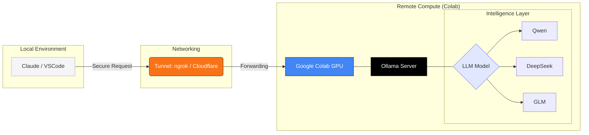

# Your Laptop Is Too Weak : Run Coding model on Colab

Tried Ollama models ?
Struggling with bigger models on your machine ? or Don't have enough powerful machine to run basic models ? and Don't have GPU 

No problem — Google Colab gives a free T4 GPU and sometimes even a v5e-1 TPU.

Let's run the model on Colab with help of Ollama. But how to use them on your machine then ? for coding and other tasks ?

We will run the models on Colab and tunnel them and connect them to our machine and use them.

## Process

1. Install Ollama
2. Start the server in the background
3. Tunnel the server (via Cloudflared)
4. access via Colab terminal and Local terminal

## Flow Diagram
<!-- ```
Laptop (VSCode / OpenWebUI)
        ↓
Tunnel URL (ngrok/cloudflare)
        ↓
Google Colab GPU
        ↓
Ollama Server
        ↓
Qwen / DeepSeek / GLM model
``` -->




<!-- <pre class="mermaid">

</pre> -->


## Step 1: Setup Ollama on Colab
Open a Google Colab notebook (set runtime to T4 GPU) and run to install ollama:
```
curl -fsSL https://ollama.com/install.sh | sh
```

Start Ollama
```
ollama serve &
```

Pull Your Heavyweight

Once the server is running, pull the model you’ve been dreaming of:
```
ollama pull qwen2.5:14b
```

> The above commands can be run into the terminal given by the Colab or the below ones in the notebook.

```python
import subprocess

# Install Ollama
!curl -fsSL https://ollama.com/install.sh | sh

# Start the server in the background
subprocess.Popen(['ollama', 'serve'])
!ollama run gemma4
```

### Common Issue: `tar: Child returned status 1`

Ollama uses `zstd` compression internally.

Google Colab images sometimes do not have `zstd` installed, causing extraction errors while pulling models.

Install it first:

```bash
!sudo apt-get update
!sudo apt-get install -y zstd
```

Then rerun the Ollama setup.

---

### GPU Detection Issues

Sometimes Ollama fails to properly detect the GPU.

Install these utilities:

```bash
!sudo apt-get update
!sudo apt-get install -y pciutils hwinfo
```

These provide tools like:

- `lspci`
- `lshw`

which help GPU detection inside Colab.

After installing them, restart the Ollama server.


## Step 2: Expose Ollama to Your Local Machine (Tunneling)
Ollama serves the model on the localhost on port 11434. URL - 
```text
http://localhost:11434 or http://127.0.0.1:11434
```
but it's not on your local machine, How will you connect it to claude code or vs code ?


Lets tunnel this Colab's localhost url to something accessible for us. 
Many tools like Ngrok, Piggy, localtunnel etc can be used but piggy and localtunnel gives you **403 Forbidden** because these services gives a middle page in front of the actual url because the tools like 
- Claude code
- vs Code
- OpenCode
are API Based and they expect raw API access, not HTML verification pages.

So we will use Cloudflare Tunnel.

```
# Install Cloudflared
!wget https://github.com/cloudflare/cloudflared/releases/latest/download/cloudflared-linux-amd64 -O cloudflared
!chmod +x cloudflared
```

Now we will run Ollama serve again with some environment variables -

```
import os
os.environ["OLLAMA_ORIGINS"] = "*"  # for remote access
os.environ["OLLAMA_HOST"] = "0.0.0.0"

# same as before
import subprocess
subprocess.Popen(['ollama', 'serve'])
```

Start the tunnel:- 
```
!./cloudflared tunnel --url http://localhost:11434
```

You will get a URL like:

```text
https://random-name.trycloudflare.com
```

Here is your remote Ollama endpoint.

---
### Common Issue: `Cloudflare failed to create url`
Due to any failed attempt previously (from other services or too many tunneling) this error may occur on Google Colab. 

500 Internal Server Error : failed to unmarshal quick Tunnel: invalid character 'e' looking for beginning of value

Fix: Do Nothing , Just wait.

> Ollama quantization makes it possible to run surprisingly large models even on a 15GB VRAM GPU.

## Limitations

Free Colab has some limitations:

- Sessions expire
- GPU access is shared resource and also have limit of resources , bigger models will share the GPU vRAM with offloading some work on the CPU (making the process slower).
- Long-running sessions may disconnect
- TPU doesn't support most of the models

But for experimentation and coding workflows, it works surprisingly well.